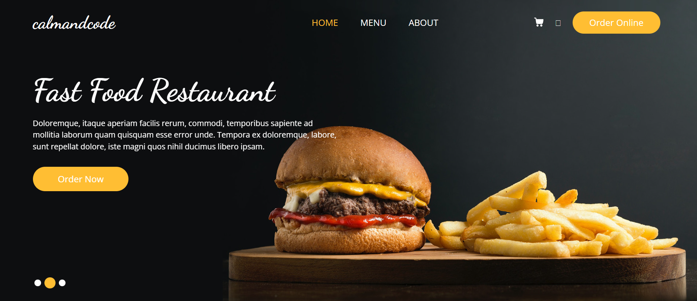
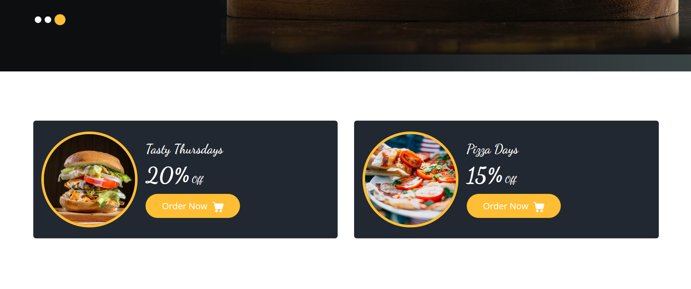
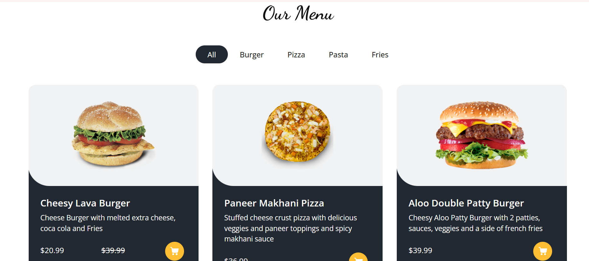
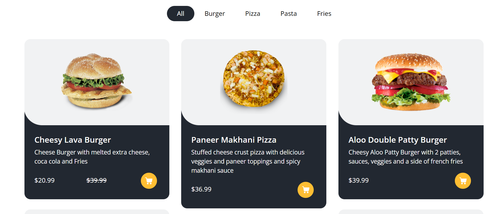
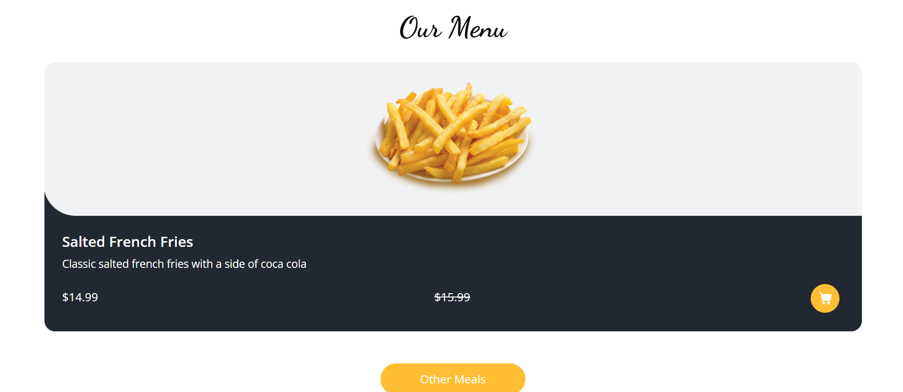
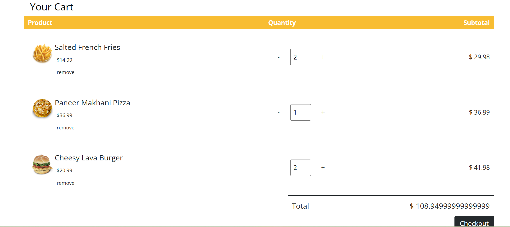
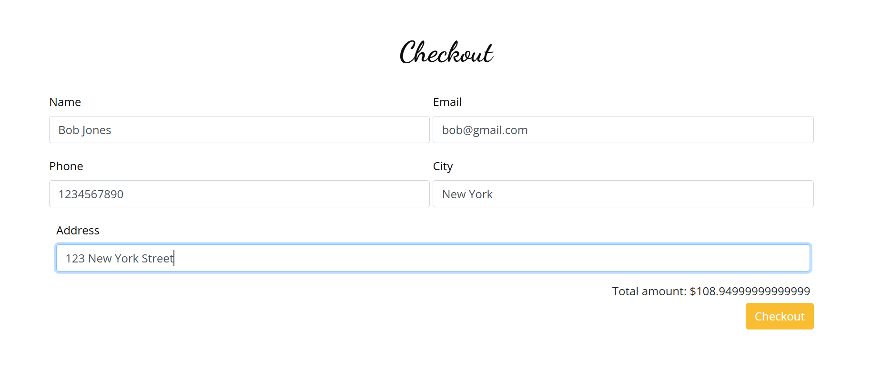
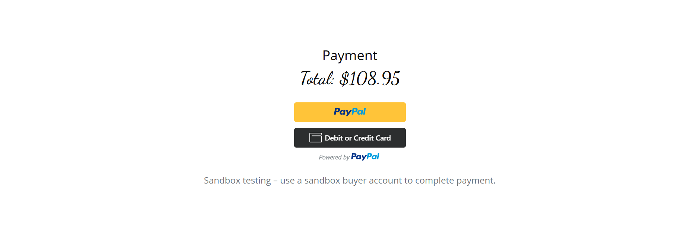
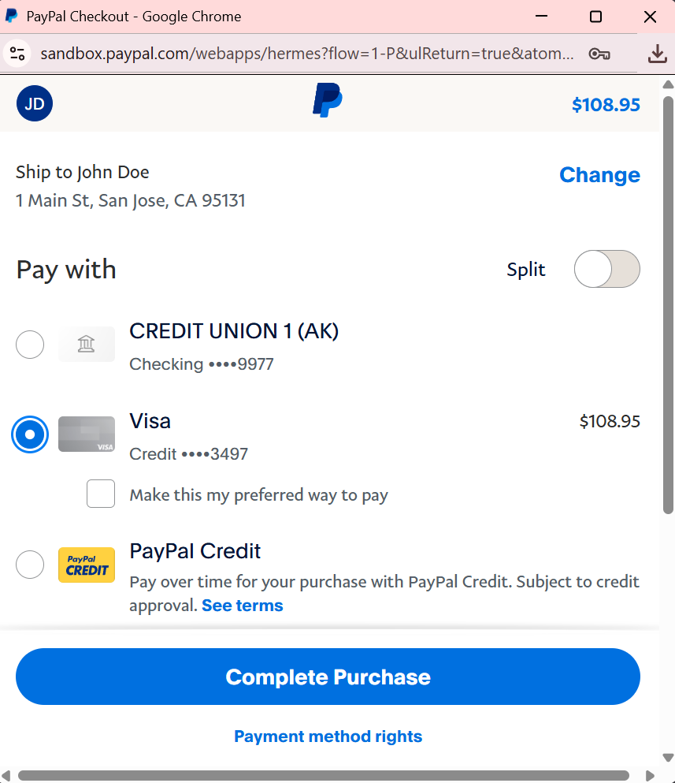
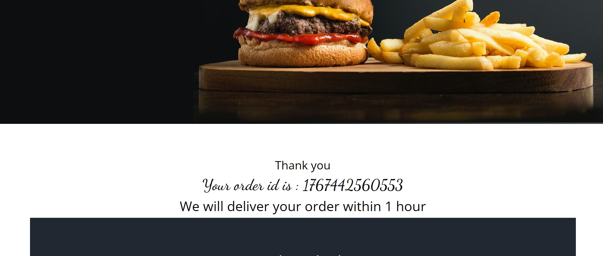

# CalmAndCode-Ecommerce-System

**CalmAndCode** is a full-stack **E-Commerce Application** designed to provide a seamless shopping experience, from product browsing to secure automated payments.

It bridges the gap between **local retailers and digital customers**, ensuring a smooth flow of order management, real-time cart updates, and reliable transaction processing.

By leveraging modern web technologies, the system empowers small businesses to establish a professional online presence, reducing manual overhead and improving customer satisfaction.

CalmAndCode's mission is to provide an accessible, secure, and high-performance shopping platform for everyone, powered by real-time data integration and user-centric design.


> **Empowering local commerce with real-time shopping logic and secure payment gateways.**

## 📑 Table of Contents
- [Features](#-features)
- [System Modules](#-system-modules)
- [Tech Stack](#-tech-stack)
- [Installation & Setup](#-installation--setup)
- [User Interface & Screenshots](#%EF%B8%8F-user-interface--screenshots)
- [Future Enhancements](#-future-enhancements)
- [License](#-license)
- [Contact](#-contact)

## 🚀 Features

- **Dynamic Product Display:** Automatically fetches product data (name, price, images) from a MySQL database and renders them using EJS templates.

- **Session-Based Shopping Cart:** Uses `express-session` to store user selections. Customers can add items, remove products, and update quantities without losing data during their session.

- **Automated Total Calculation:** Real-time logic that calculates sub-totals, sale prices, and final checkout costs automatically based on cart contents.

- **Secure Order Management:** Captures user shipping details and stores orders into a permanent MySQL database, linking products to specific order IDs.

- **PayPal Sandbox Integration:** Features a fully integrated payment gateway. It handles the "Create Order" and "Capture Intent" flows using the PayPal JavaScript SDK.

- **Environment Security:** Protects sensitive database credentials and API Client IDs using `dotenv`, ensuring that private keys are never exposed on version control.

## 🧩 System Modules

- **Authentication & Session Module:** Manages user sessions to maintain persistent shopping carts. It ensures that data is stored safely as the user navigates between pages.

- **Inventory Module:** Handles the connection to the MySQL database. It performs queries to retrieve product details and handles stock-related information displayed to the user.

- **Cart & Logic Module:** The engine of the site. It handles the mathematical logic for pricing, quantity increments/decrements, and the "Add to Cart" POST requests.

- **Order Processing Module:** Transforms cart data into a database entry. It saves customer information (Name, City, Phone) and maps order items to their respective transactions.

- **Payment Gateway Module:** Communicates with the PayPal API. It renders the smart payment buttons and handles the redirect logic upon a successful transaction.

## 🛠 Tech Stack

| **Layer** | **Technology** | **Purpose** |
| :--- | :--- | :--- |
| **Frontend** | HTML5, CSS3, EJS | Dynamic UI rendering & Templating |
| **Backend** | Node.js + Express.js | Server-side logic & API Routing |
| **Database** | MySQL | Persistent storage for products & orders |
| **Styling** | Bootstrap 4 | Responsive design and mobile compatibility |
| **Payments** | PayPal SDK | Secure transaction processing |
| **Security** | Dotenv | Environment variable management |
| **Tools** | Git + GitHub | Version control |

<p align="center">
  <a href="https://nodejs.org/"></a>
  <a href="https://expressjs.com/"></a>
  <a href="https://www.mysql.com/"></a>
  <a href="https://getbootstrap.com/"></a>
  <a href="https://paypal.com/"></a>
</p>

## 💻 Installation & Setup

### 1. Clone the Repository
```bash
git clone https://github.com/your-username/your-repo-name.git
cd your-repo-name
```

### 2. Install Dependencies

```bash
npm install
```

### 3. Configure Environment Variables

Create a `.env` file in the root folder:

```env
PORT=8081
DB_HOST=127.0.0.1
DB_USER=root
DB_PASSWORD=your_password
DB_NAME=node_project
DB_PORT=3307
PAYPAL_CLIENT_ID=your_paypal_id
```

### 4. Start the Application

```bash
node index.js
```

### 5. Access the Application

Open your browser and go to [http://localhost:8081](http://localhost:8081)

## 🖥️ User Interface & Screenshots

### 1. Homepage - Hero Section
The landing page features a full-width hero slider with compelling call-to-action buttons and smooth navigation. The responsive header includes the brand logo, menu links, and a shopping cart icon that updates in real-time.



---

### 2. Special Offers Section
Promotional cards showcase limited-time deals with eye-catching visuals. Each offer displays the discount percentage and includes direct "Order Now" functionality with integrated cart icons for seamless shopping.



---

### 3. Product Menu Grid
The dynamic menu section pulls product data directly from the MySQL database. Features include filterable categories (All, Burger, Pizza, Pasta, Fries), product images, descriptions, and pricing. Each product card includes an instant "Add to Cart" button for quick purchases.



---

### 4. Product Pricing Details
Close-up view demonstrating the automated pricing logic. Products with sale prices display both the original price (strikethrough) and the discounted price, calculated server-side. The shopping cart icon allows one-click additions to the session-based cart.



---

### 5. Single Product Page
Individual product view offering detailed information including full descriptions, high-resolution images, and prominent add-to-cart functionality. This page demonstrates the dynamic routing system using product IDs from the database.



---

### 6. Shopping Cart
The cart page showcases session management in action. Users can adjust quantities with increment/decrement controls, view individual item prices, and see real-time subtotal calculations. All cart data persists throughout the user's session using `express-session` middleware.



---

### 7. Checkout & Payment Integration
The secure checkout page collects essential customer information (name, city, phone) and displays the order summary with final total. The integrated PayPal Smart Payment Buttons handle the complete transaction flow, from order creation to payment capture, using the official PayPal JavaScript SDK.



---

### 8. PayPal Payment Interface
When users click the PayPal button, they're redirected to PayPal's secure payment interface displaying the order total ($108.95). The sandbox environment allows for safe testing with test accounts. Users can choose to pay with PayPal balance, linked bank accounts, or credit/debit cards.



---

### 9. PayPal Checkout Flow
The PayPal checkout interface shows the complete payment options including saved payment methods, PayPal Credit, and the ability to split payments. The interface displays shipping information and provides a seamless "Complete Purchase" flow. This demonstrates the full integration with PayPal's JavaScript SDK handling the entire transaction securely.



---

### 10. Order Confirmation
Upon successful payment, customers receive an order confirmation with a unique order ID. The system automatically stores the complete order details, including customer information and purchased items, into the MySQL database for future reference and order tracking.



---


## 🚀 Future Enhancements

* **Admin Dashboard:** A secure area to add/edit products and view sales analytics.
* **Search & Filter:** Advanced product filtering by category, price range, and popularity.
* **User Accounts:** Full registration and login for order history tracking.
* **Email Invoices:** Automated receipt generation via Nodemailer after successful payment.
* **Inventory Management:** Real-time stock tracking and low-stock alerts.
* **Order Tracking:** Customer portal to track order status and delivery updates.

## 📄 License

This project is licensed under the **MIT License** - see the [LICENSE](LICENSE) file for details.

```
MIT License

Copyright (c) 2025 [Your Name]

Permission is hereby granted, free of charge, to any person obtaining a copy
of this software and associated documentation files (the "Software"), to deal
in the Software without restriction, including without limitation the rights
to use, copy, modify, merge, publish, distribute, sublicense, and/or sell
copies of the Software, and to permit persons to whom the Software is
furnished to do so, subject to the following conditions:

The above copyright notice and this permission notice shall be included in all
copies or substantial portions of the Software.

THE SOFTWARE IS PROVIDED "AS IS", WITHOUT WARRANTY OF ANY KIND, EXPRESS OR
IMPLIED, INCLUDING BUT NOT LIMITED TO THE WARRANTIES OF MERCHANTABILITY,
FITNESS FOR A PARTICULAR PURPOSE AND NONINFRINGEMENT. IN NO EVENT SHALL THE
AUTHORS OR COPYRIGHT HOLDERS BE LIABLE FOR ANY CLAIM, DAMAGES OR OTHER
LIABILITY, WHETHER IN AN ACTION OF CONTRACT, TORT OR OTHERWISE, ARISING FROM,
OUT OF OR IN CONNECTION WITH THE SOFTWARE OR THE USE OR OTHER DEALINGS IN THE
SOFTWARE.
```

## 📬 Contact

For support or collaboration: **manwanidiksh@gmail.com**

---

⭐ *If you found this project helpful, consider starring it on GitHub!*

---

**Built with ❤️ using Node.js, Express, MySQL, and PayPal**